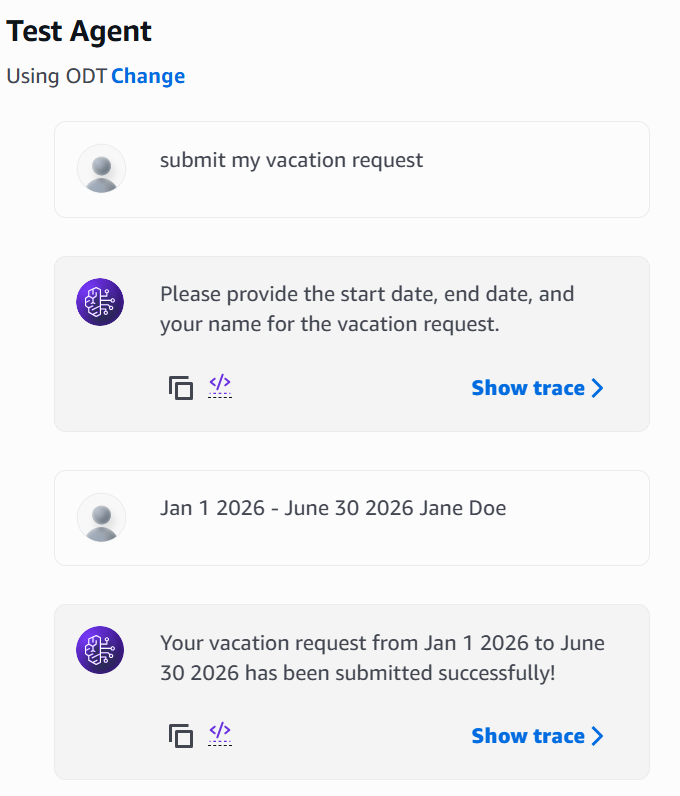

# 🤖 AWS Bedrock AI Smart Assistant

An AI-powered HR assistant built on **Amazon Bedrock** that handles employee queries about policies, benefits, and leave requests — automatically, at scale, and around the clock.

---

## 📋 Project Overview

The HR department was overwhelmed with **500+ daily employee requests** covering policies, benefits, and procedures. Requests could only be handled during business hours with limited simultaneous replies — creating bottlenecks and delays.

This project solves that by deploying a fully automated AI agent that:
- Answers HR policy and benefits questions using a **RAG (Retrieval-Augmented Generation)** knowledge base
- Accepts and logs **vacation/leave requests** directly into a database
- Operates **24/7** with unlimited simultaneous responses

---

## 🏗️ Architecture

---

## ☁️ AWS Services Used

| Service | Purpose |
|---|---|
| **Amazon Bedrock** | Hosts and runs the AI agent (`hr-assistant-agent`) using the `amazon.nova-pro-v1` model |
| **Amazon S3** | Stores source documents for the knowledge base (`compensation_handbook.txt`, `employee_handbook.txt`) |
| **Amazon OpenSearch Serverless** | Vector search collection (`kb-collection`) for semantic document retrieval |
| **AWS Lambda** | Two functions: `submit_leave` (logs vacation requests) and `submit_benefits` (handles benefits submissions) — both write to DynamoDB |
| **Amazon DynamoDB** | Stores submitted requests in `VacationTable` and `BenefitsTable` |

---

## 🔧 Components

### Bedrock Agent
- **Name:** `hr-assistant-agent`
- **Model:** `amazon.nova-pro-v1`
- **Action Groups:**
  - `submit_leave_action` — triggers `submit_leave` Lambda when a leave request is submitted
  - `submit_benefits_action` — triggers `submit_benefits` Lambda when a benefits enrollment is submitted
- **Knowledge Base:** Connected to OpenSearch Serverless for answering policy/benefits questions via RAG

### Knowledge Base (RAG)
- **S3 Bucket:** `knowledge-base-bucket-cb4012a0`
- **Documents:** `employee_handbook.txt` (7.1 KB), `compensation_handbook.txt` (1.0 KB)
- **Vector Store:** OpenSearch Serverless collection (`kb-collection`, type: Vectorsearch)

### DynamoDB Tables

**VacationTable** — stores submitted leave requests:

| Attribute | Type | Example |
|---|---|---|
| `employee_name` | String (PK) | Jane Doe |
| `startDate` | String | Jan 1 2026 |
| `endDate` | String | June 30 2026 |

**BenefitsTable** — stores benefits enrollment submissions (written by `submit_benefits` Lambda)

---

## 💬 Example Interaction

---

## 🚀 Setup Summary

1. Upload HR documents to S3
2. Create OpenSearch Serverless collection and index
3. Create Bedrock Knowledge Base pointing to S3 + OpenSearch
4. Deploy Lambda function with DynamoDB write permissions
5. Create Bedrock Agent with the knowledge base and action group attached
6. Prepare and test the agent

---

## 📚 Reference

Hosted by the **AWS Cloud Club** at UNC Charlotte.
Built following the **AWS SimuLearn: Create an AI Smart Assistant** lab on AWS Skill Builder.

---

## 📜 Created By: Shaunak Peri
